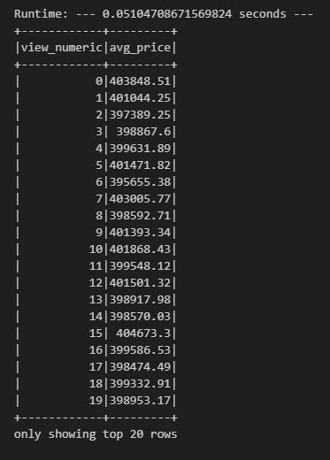
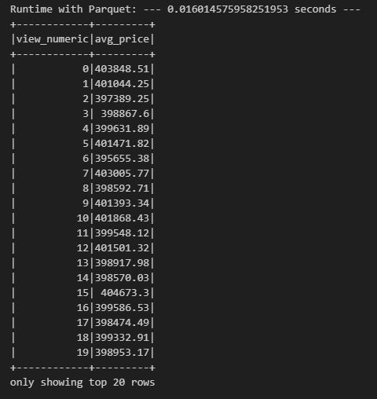

# Home Sales Data Analysis

  

In this challenge, you'll use your knowledge of SparkSQL to determine key metrics about home sales data. Then you'll use Spark to create temporary views, partition the data, cache and uncache a temporary table, and verify that the table has been uncached.

## Instructions

1. **File Renaming**: Rename the Home_Sales_starter_code.ipynb file as Home_Sales.ipynb.

2. **Import Necessary PySpark SQL Functions**: Import the necessary PySpark SQL functions for this assignment.

3. **Read Home Sales Data**: Read the home_sales_revised.csv data in the starter code into a Spark DataFrame.

4. **Create Temporary Table**: Create a temporary table called home_sales.

5. **Answer Questions Using SparkSQL**:
   - What is the average price for a four-bedroom house sold for each year? Round off your answer to two decimal places.
   - What is the average price of a home for each year it was built that has three bedrooms and three bathrooms? Round off your answer to two decimal places.
   - What is the average price of a home for each year that has three bedrooms, three bathrooms, two floors, and is greater than or equal to 2,000 square feet? Round off your answer to two decimal places.
   - What is the "view" rating for homes costing more than or equal to $350,000? Determine the run time for this query, and round off your answer to two decimal places.

6. **Cache Temporary Table**: Cache your temporary table home_sales.

7. **Check Table Caching**: Check if your temporary table is cached.

8. **Filter Data Using Cached Table**: Using the cached data, run the query that filters out the view ratings with an average price of greater than or equal to $350,000. Determine the runtime and compare it to uncached runtime.

9. **Data Partitioning**: Partition by the "date_built" field on the formatted parquet home sales data.

10. **Create Temporary Table for Parquet Data**: Create a temporary table for the parquet data.

11. **Filter Data Using Parquet Table**: Run the query that filters out the view ratings with an average price of greater than or equal to $350,000. Determine the runtime and compare it to uncached runtime.

12. **Uncache Temporary Table**: Uncache the home_sales temporary table.

13. **Verify Uncaching**: Verify that the home_sales temporary table is uncached using PySpark.

14. **GitHub Repository**: Download your Home_Sales.ipynb file and upload it into your "Home_Sales" GitHub repository.

## Results and Analysis

### Uncached Data

  

### Cached Data

  

### Parquet Data

  

## Analysis

- Caching the temporary table significantly improves query performance, reducing the runtime by more than half compared to uncached data.
- Using Parquet-formatted data further enhances query speed, resulting in a runtime similar to the cached data.
- Caching and Parquet optimization are effective strategies to boost query performance and reduce processing time.
